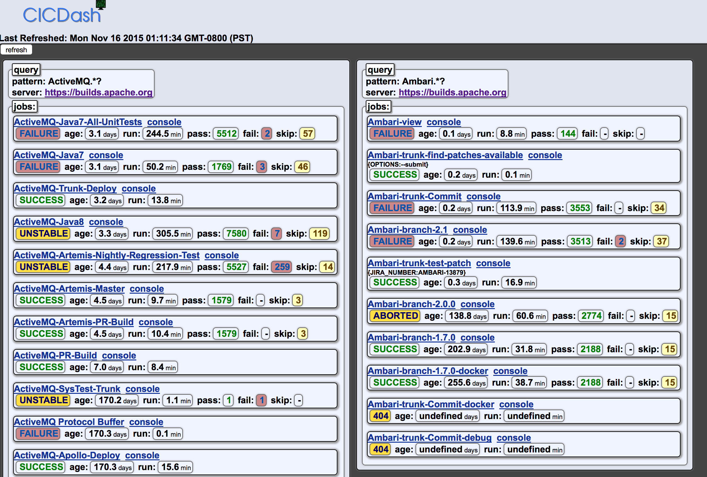

# CICDash
A dashboard for viewing Continuous Integration / Continuous Development job builds and pipelines

It's 10 am on Monday. Do you know if any of your job builds are failing? Keeping track of even a few job pipelines can quickly overwhelm your inbox. You want to do creative work, but first you need to know: "do I need to fix anything?"
If only there were a dashboard where you could see on one page the most recent builds for all your pipeline jobs.

Enter CICDash:  A dashboard microservice jar you can run on localhost or server of your choice. Just compose a single json request and post it using the built in form to a rest endpoint.

Note: this project is in early stages. Feedback, feature requests and pull requests are welcome.

Current build systems supported: Jenkins.

Installation
===============

git clone https://github.com/ericdriggs/cicdash
./install.sh

Usage
===========
./run.sh
browse to http://localhost:8080/
submit json payload

Example
============

Payload:
[
    {
        "jenkinsServerUrl" : "https://builds.apache.org"
        ,"jobNamePattern" : "ActiveMQ.*?"
    },
    {
        "jenkinsServerUrl" : "https://builds.apache.org"
        ,"jobNamePattern" : "Ambari.*?"
    },
    {
        "jenkinsServerUrl" : "https://builds.apache.org"
        ,"jobNamePattern" : "Accumulo.*?"
    }

]

Response:

Format: 

